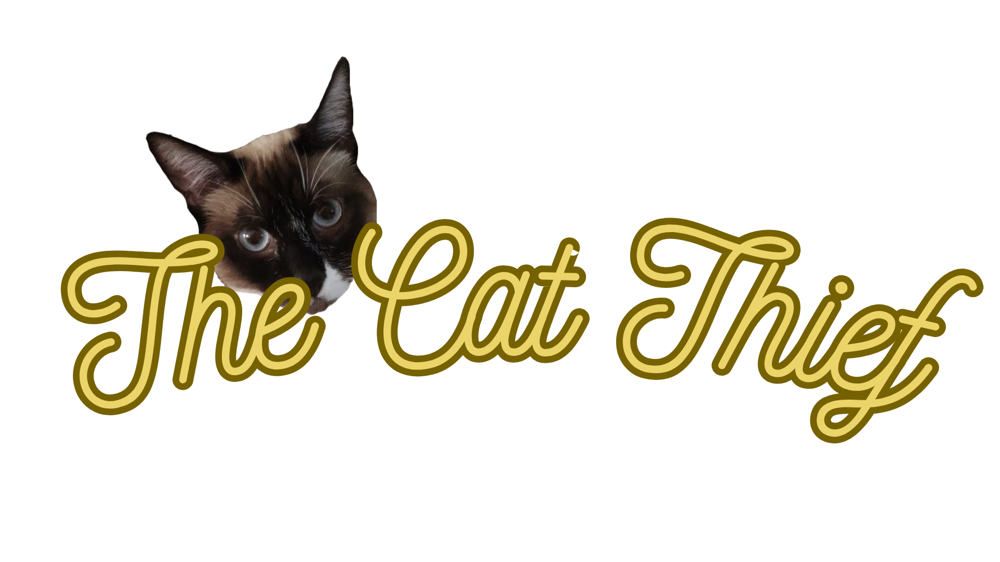

# THE CAT THIEF

## [Play the Game!](https://raulgarrigos.github.io/the-cat-thief/)

# Description

The Cat Thief is a game based on classic gameplays you will already know. You are Mochi Antúnez, the famous thief, trying to steal food from Lady Momo, Marquise of Salmonete.

Food and obstacles will fall down, so you can just wait for them, avoiding the obstacles and catching the food to gain points... Or you can move frenetically while you shoot, avoid and catch. Your choice!

I hope you enjoy the game and...

All hail the Cat Thief!!!

# Main Functionalities

- Move with Arrows (Horizontal, vertical and diagonal)
- Shoot shuriken with Space
- Pause the game at any time
- Restart the game if you're not feeling the run
- Gain points touching the food
- Three lives
- Lose life touching the obstacles (Momo's shouts)
- Recover life touching a lifesaver (Just a little nap...)
- Five levels
- Increasing the level every 20 points, making everything faster
- At level 3 there will be a new obstacle
- At level 3 you could destroy points by mistake
- At level 4 the player will become Momo
- At level 4 Mochi will become a new enemy (to Momo, but he will actually give you more points than anything)
- Momo will shoot flowers
- Win the game at 100 points (Even though for Momo will be a lose)

# Backlog Functionalities

- Make it responsive for mobiles
- Make it longer with more levels and a point cap of 150.
- When Momo becomes the player, make the obstacles points and the points obstacles (like if Mochi was throwing the food to her to escape)
- Make Mochi the player again and Momo the "enemy"
- A final level with Momo as the boss.

# Technologies used

- HTML
- CSS
- Javascript
- DOM Manipulation

# States

- Main screen
- Game screen
- Game Over screen
- Win screen

# Extra Links

### Sketch

[Link](https://excalidraw.com/#json=ELMoVDiE0chh1m96sQBa2,tuaodEs9V1HRJmr7nYAGHQ)

### Trello

[Link](https://trello.com/b/hxxukApw/the-cat-thief)

### Slides

[Link](https://www.canva.com/design/DAFycO6LvrY/XGmM3fULkOWPoul9dMIupw/view?utm_content=DAFycO6LvrY&utm_campaign=share_your_design&utm_medium=link&utm_source=shareyourdesignpanel#1)

## Deploy

[Link](https://raulgarrigos.github.io/the-cat-thief/)
